<!-- ══════════════════════════════════════════════════════════════════════ -->
<!--                     HERO — ANIMATED BANNER                           -->
<!-- ══════════════════════════════════════════════════════════════════════ -->

<div align="center">


</div>
<!-- ══════════════════════════════════════════════════════════════════════ -->
<!--                      TYPING ANIMATION                                -->
<!-- ══════════════════════════════════════════════════════════════════════ -->

<div align="center">

<a href="https://git.io/typing-svg">

</a>

</div>

<br/>

<!-- ══════════════════════════════════════════════════════════════════════ -->
<!--                   SOCIAL LINKS + VISITOR COUNTER                     -->
<!-- ══════════════════════════════════════════════════════════════════════ -->

<div align="center">

<a href="mailto:gupta.shiwank09@gmail.com">
  
</a>
&ensp;
<a href="https://www.linkedin.com/in/guptashiwank/">
  
</a>
&ensp;
<a href="https://github.com/SHIWANK72">
  
</a>
&ensp;


</div>

<br/>

<!-- ══════════════════════════════════════════════════════════════════════ -->
<!--                    ANIMATED DIVIDER                                  -->
<!-- ══════════════════════════════════════════════════════════════════════ -->

<div align="center">

</div>

<br/>

<!-- ══════════════════════════════════════════════════════════════════════ -->
<!--                  ENGINEERING IDENTITY CARD                           -->
<!-- ══════════════════════════════════════════════════════════════════════ -->

<div align="center">

```
┌─────────────────────────────────────────────────────────────────────────────────┐
│                                                                                 │
│   ◈  ENGINEER          Shiwank Gupta                                            │
│   ◈  DISCIPLINE        VLSI Design · Design Verification · Low-Power CMOS      │
│   ◈  SPECIALIZATION    RTL Engineering · Digital ASIC Flow · Physical Design   │
│   ◈  ACADEMIC          B.Tech — Electronics & Communication Engineering         │
│                         UIET, Kurukshetra University |                          │
│   ◈  DIPLOMA           Electrical Engineering — Gold Medalist |                 │
│                                                                                 │
│   ━━━━━━━━━━━━━━━━━━━━━━━━━━━━━━━━━━━━━━━━━━━━━━━━━━━━━━━━━━━━━━━━━━━━━━━━━  │
│                                                                                 │
│   PRESENT  ▸  NIK-CORE RTL-to-GDSII · 7-Day AMBA Sprint · OpenLane + Sky130    │
│   VECTOR   ▸  Design Verification · STA · Timing Closure · Physical Design     │
│   FRONTIER ▸  UVM · ASIC Tapeout · Global Semiconductor R&D                   │
│                                                                                 │
└─────────────────────────────────────────────────────────────────────────────────┘
```

</div>

<br/>

<!-- ══════════════════════════════════════════════════════════════════════ -->
<!--                    ENGINEERING DOMAINS                               -->
<!-- ══════════════════════════════════════════════════════════════════════ -->

## `// 01` &nbsp; Engineering Domains

<br/>

<table width="100%">
<tr>
<td width="25%" valign="top">

**`VLSI / ASIC DESIGN`**

```yaml
RTL Design:
  - Verilog / SystemVerilog
  - Digital ASIC Flow
  - Logic Synthesis
  - Clock Tree Synthesis

Analysis:
  - STA / Timing Closure
  - Power Analysis (PX)
  - DRC / LVS
  - Parasitic Extraction

Memory:
  - 6T SRAM (Full-Custom)
  - SNM Characterization
  - Multi-Corner SPICE
  - BSIM4 Modeling
```

</td>
<td width="25%" valign="top">

**`DESIGN VERIFICATION`**

```yaml
Functional Sim:
  - Testbench Development
  - Self-Checking TB
  - Directed Stress Testing
  - Multi-Corner Corners

Protocols:
  - AMBA AXI4-Lite
  - AHB / APB
  - UART / SPI / I2C
  - CAN Bus

Frontier:
  - SystemVerilog DV
  - UVM Methodology
  - Functional Coverage
  - Assertion-Based DV
```

</td>
<td width="25%" valign="top">

**`LOW-POWER CMOS`**

```yaml
Clock Management:
  - Static ICG Gating
  - Dynamic Gating
  - Hybrid ICG Schemes
  - CTS Power Opt.

Power Techniques:
  - Power Gating
  - Multi-VTH Design
  - Dynamic Power Opt.
  - Static Power Opt.

NTV Research:
  - Near-Threshold Voltage
  - 28 nm HKMG Analysis
  - 65 nm Bulk CMOS
  - PDP Benchmarking
```

</td>
<td width="25%" valign="top">

**`PHYSICAL DESIGN — RTL TO GDSII`**

```yaml
PnR Flow:
  - Floorplanning
  - Placement & Routing
  - Clock Tree Synthesis
  - Power Grid Design (PDN)

Open-Source EDA:
  - OpenLane (RTL→GDSII)
  - Sky130 PDK
  - Magic VLSI · KLayout
  - OpenROAD

Signoff:
  - DRC-Clean Routing
  - GDSII Streamout
  - LVS (In Progress)
  - Antenna Check
```

</td>
</tr>
</table>

<br/>

<div align="center">

</div>

<br/>

<!-- ══════════════════════════════════════════════════════════════════════ -->
<!--                      TECHNICAL STACK                                 -->
<!-- ══════════════════════════════════════════════════════════════════════ -->

## `// 02` &nbsp; Technical Stack

<br/>

<div align="center">

**─── EDA & Simulation Platforms ───**


&nbsp;

&nbsp;

&nbsp;

&nbsp;

&nbsp;


<br/><br/>

**─── Physical Design / RTL-to-GDSII (Open-Source) ───**


&nbsp;

&nbsp;

&nbsp;

&nbsp;

&nbsp;


<br/><br/>

**─── HDL & Programming ───**


&nbsp;

&nbsp;

&nbsp;

&nbsp;

&nbsp;


<br/><br/>

**─── FPGA & Hardware Platforms ───**


&nbsp;

&nbsp;

&nbsp;

&nbsp;

&nbsp;


<br/><br/>

**─── Protocols & Interfaces ───**


&nbsp;

&nbsp;

&nbsp;

&nbsp;

&nbsp;


<br/><br/>

**─── Frontier — Active Study ───**


&nbsp;

&nbsp;

&nbsp;


</div>

<br/>

<div align="center">

</div>

<br/>

<!-- ══════════════════════════════════════════════════════════════════════ -->
<!--               QUANTIFIED RESEARCH RESULTS                            -->
<!-- ══════════════════════════════════════════════════════════════════════ -->

## `// 03` &nbsp; Quantified Research Results

<br/>

<div align="center">

```
╔═══════════════════════════════════════════════════════════════════════════════╗
║                       PUBLISHED RESEARCH METRICS                             ║
╠═══════════════════════════════════════════════════════════════════════════════╣
║                                                                               ║
║  CLOCK GATING RESEARCH — 45 nm CMOS @ 200 MHz                                ║
║  ├─ Baseline Dynamic Power    :  48.9 mW                                     ║
║  ├─ Post-ICG Dynamic Power    :  18.7 mW                                     ║
║  └─ Reduction Achieved        :  61.7%  ◀── PUBLISHED RESULT                 ║
║                                                                               ║
║  FLIP-FLOP ARCHITECTURE STUDY — 28 nm HKMG + 65 nm Bulk CMOS (NTV)          ║
║  ├─ Architectures Benchmarked :  4  (Standard, TGFF, MHLAFF, ATC-SCDFF)    ║
║  ├─ Best Power-Delay Product  :  0.32 fJ  (ATC-SCDFF)                       ║
║  └─ PDP Improvement           :  69%  over baseline  ◀── PUBLISHED RESULT    ║
║                                                                               ║
║  6T SRAM CELL — Full-Custom SPICE Characterization (BSIM4)                   ║
║  ├─ Static Noise Margin (SNM) :  92–108 mV                                  ║
║  ├─ Corners Tested            :  TT / SS / FF / SNFP / FNSP                 ║
║  └─ Method                    :  Butterfly Curve + Systematic Transistor Sizing║
║                                                                               ║
║  NIK-CORE — RTL-to-GDSII ASIC FLOW (Sky130A · OpenLane)                     ║
║  ├─ Flow Coverage             :  Synthesis → Floorplan → Placement → CTS →   ║
║  │                                Routing → GDSII Streamout                  ║
║  ├─ Routing Signoff           :  DRC-Clean (0 violations post detailed route)║
║  ├─ Standard Cells Placed     :  362  (8 DFFs · combinational logic)        ║
║  ├─ Core Utilization          :  54.87%                                     ║
║  └─ Max Frequency (STA)       :  ~90.9 MHz  ◀── HANDS-ON PHYSICAL DESIGN     ║
║                                                                               ║
╚═══════════════════════════════════════════════════════════════════════════════╝
```

</div>

<br/>

<!-- ══════════════════════════════════════════════════════════════════════ -->
<!--               ENGINEERING COMPETENCIES DASHBOARD                     -->
<!-- ══════════════════════════════════════════════════════════════════════ -->

## `// 04` &nbsp; Engineering Competencies

<br/>

<table width="100%">
<tr>
<td width="33%" valign="top">

**VLSI / ASIC Design**

| Competency | Proficiency |
|---|---|
| RTL Design (Verilog) | `██████████` Production |
| Clock Gating (ICG) | `█████████░` Strong |
| Low-Power CMOS Analysis | `█████████░` Strong |
| SPICE / Circuit Sim | `████████░░` Solid |
| FPGA Implementation | `████████░░` Solid |
| Logic Synthesis | `████████░░` Solid |
| Cadence Virtuoso | `██████░░░░` Developing |

</td>
<td width="33%" valign="top">

**Design Verification**

| Competency | Proficiency |
|---|---|
| Functional Testbench | `████████░░` Solid |
| Multi-Corner Simulation | `███████░░░` Growing |
| STA / Timing Closure | `███████░░░` Growing |
| DRC / LVS | `███████░░░` Growing |
| SystemVerilog DV | `██████░░░░` Active Study |
| UVM Methodology | `████░░░░░░` Frontier |

</td>
<td width="33%" valign="top">

**Physical Design — RTL to GDSII**

| Domain | Status |
|---|---|
| Floorplanning / P&R | `████████░░` Hands-On |
| Clock Tree Synthesis | `████████░░` Hands-On |
| GDSII Streamout (Magic) | `████████░░` Hands-On |
| Routing DRC Signoff | `███████░░░` Growing |
| LVS Signoff (netgen) | `████░░░░░░` In Progress |
| Full Custom Layout | `████░░░░░░` Frontier |

</td>
</tr>
</table>

<br/>

<div align="center">

</div>

<br/>

<!-- ══════════════════════════════════════════════════════════════════════ -->
<!--                    FLAGSHIP PROJECTS                                 -->
<!-- ══════════════════════════════════════════════════════════════════════ -->

## `// 05` &nbsp; Flagship Engineering Projects

<br/>

<details open>
<summary><b>&nbsp; 01 · NIK-CORE — 8-bit RISC Processor — RTL to GDSII</b> &nbsp;—&nbsp; <i>Custom ISA · OpenLane · Sky130 PDK · Magic VLSI · KLayout · Nik-Coronics R&D</i></summary>

<br/>

```
┌─ PHYSICAL DESIGN SPECIFICATION ─────────────────────────────────────────────┐
│  Architecture     :  8-bit RISC — Custom Instruction Set Architecture       │
│  PDK / Node       :  Sky130A — SkyWater 130 nm Open-Source PDK             │
│  EDA Flow         :  OpenLane (Yosys · OpenROAD · Magic · KLayout)         │
│  Flow Coverage    :  Synthesis → Floorplan → Placement → CTS → Routing →   │
│                       DRC-Clean Detailed Route → GDSII Streamout           │
│  Standard Library :  sky130_fd_sc_hd                                        │
│  Result           :  DRC-Clean Routing · 362 Cells Placed · GDSII Generated│
└─────────────────────────────────────────────────────────────────────────────┘
```

**Design Objective:** Take a custom 8-bit RISC processor from RTL through the complete open-source digital ASIC backend flow — synthesis, floorplanning, placement, clock tree synthesis, routing, and final GDSII layout generation — using OpenLane on the Sky130A process design kit.

**Physical Design Flow Coverage:**
- **Synthesis:** RTL (ALU, control unit, register file, PC, instruction decoder, top-level integration) synthesized to sky130_fd_sc_hd standard cells via Yosys.
- **Floorplanning:** Die area definition, IO pin placement, tap/decap cell insertion, power distribution network (PDN) generation.
- **Placement:** Global and detailed placement with resizer-based design optimization.
- **Clock Tree Synthesis (CTS):** Clock buffer insertion and clock network balancing via OpenROAD.
- **Routing:** Global and detailed routing achieving a **fully DRC-clean route** (0 violations post detailed routing) across all metal layers.
- **GDSII Streamout:** Final layout generated and verified in Magic VLSI, cross-checked visually in KLayout with the Sky130A layer property (.lyp) mapping.

**Physical Design Metrics (from OpenLane metrics.csv):**
- Core Utilization: 54.87% · Die Area: 0.00435 mm²
- Total Placed Cells: 362 (8 DFFs, combinational logic: AND/NAND/NOR/OR/XOR/XNOR/MUX gates)
- Routed Wire Length: 931,138 units · Vias: 822
- STA Critical Path: 11.0 ns → Max Safe Frequency: ~90.9 MHz

**Engineering Value:** This project demonstrates hands-on, tool-verified competency across the full digital ASIC backend — not just RTL simulation — directly relevant to Physical Design, DFT, and ASIC Verification roles in the semiconductor industry.

**Status:** RTL-to-GDSII core flow complete and DRC-clean. LVS (netgen) and full antenna signoff in progress as the next milestone toward Efabless OpenMPW shuttle submission readiness.

</details>

---

<details>
<summary><b>&nbsp; 02 · 7-Day AMBA Protocol Series</b> &nbsp;—&nbsp; <i>AXI4-Lite · Active Sprint · Nik-Coronics R&D</i></summary>

<br/>

```
┌─ SPRINT SPECIFICATION ──────────────────────────────────────────────────────┐
│  Protocol Target  :  AMBA AXI4-Lite — ARM AMBA 4 Specification              │
│  Focus            :  Write / Read Channels · Handshaking · Response Logic   │
│  HDL              :  Verilog / SystemVerilog · Xilinx Vivado                 │
│  Verification     :  Self-Checking Testbenches · Waveform Analysis           │
│  Status           :  ACTIVE — Day-by-Day Structured Implementation           │
└─────────────────────────────────────────────────────────────────────────────┘
```

**Engineering Objective:** Implement a production-quality AXI4-Lite Master-Slave interface from scratch within a structured 7-day sprint — with complete functional verification and waveform-validated VALID-READY handshaking compliance.

**Protocol Coverage:** AXI4-Lite Write Address / Write Data / Write Response channels. AXI4-Lite Read Address / Read Data channels. VALID-READY handshake protocol compliance. Back-pressure and stall behavior testing.

**Verification Strategy:** Transaction-level testbenches with VALID/READY randomization for corner-case coverage. BRESP/RRESP response decoding verification. Functional comparison against ARM-spec expected behavior at each channel.

**Engineering Value:** This sprint operationalizes the AMBA protocol knowledge required for AXI-connected IP block integration — a critical skill in any modern SoC or ASIC design flow.

</details>

---

<details>
<summary><b>&nbsp; 03 · 14-Day RTL-to-DV Development Series</b> &nbsp;—&nbsp; <i>Systematic Architecture Build · Verilog · Xilinx Vivado · FPGA Validated</i></summary>

<br/>

```
┌─ SERIES SPECIFICATION ──────────────────────────────────────────────────────┐
│  Target           :  RTL design + full verification per module               │
│  Toolchain        :  Verilog / SystemVerilog · Xilinx Vivado                 │
│  Coverage         :  14 progressive modules — Basic Gates to Full Processor  │
│  Hardware         :  FPGA board deployment and validation — Artix-7          │
└─────────────────────────────────────────────────────────────────────────────┘
```

```
  Day 01  ·  Basic Logic Gates                    [DONE]  Complete
  Day 02  ·  Multiplexer / Demultiplexer           [DONE]  Complete
  Day 03  ·  Ripple Carry Adder (RCA)              [DONE]  Complete
  Day 04  ·  Decoder / Priority Encoder            [DONE]  Complete
  Day 05  ·  D Flip-Flop (Sync & Async Reset)      [DONE]  Complete
  Day 06  ·  Shift Registers / Up Counter          [DONE]  Complete
  Day 07  ·  FSM — Moore & Mealy                   [DONE]  Complete
  Day 08  ·  FIFO Memory Buffer                    [DONE]  Complete
  Day 09  ·  SRAM Memory Controller                [DONE]  Complete
  Day 10  ·  UART Transmitter                      [DONE]  Complete
  Day 11  ·  ──────────────────────────────────── [ >> ]  In Progress
   ...
  Day 14  ·  Full DV Testbench — SystemVerilog     [TGT]  Target
```

**Engineering Approach:** Every module — RTL design, synthesis, self-checking testbench, and FPGA bitstream — built independently to production standard before proceeding. 100% functional coverage targeted per module.

**Lessons Reinforced:** Correct reset strategy (sync vs async) dictates timing constraints significantly. FIFO full/empty flag edge cases require careful pointer arithmetic — one-off errors cause silent data corruption.

</details>

---

<details>
<summary><b>&nbsp; 04 · Clock Gating Optimization — 61.7% Dynamic Power Reduction</b> &nbsp;—&nbsp; <i>45 nm CMOS · 200 MHz · Published Research · Synopsys PrimeTime PX</i></summary>

<br/>

```
┌─ RESEARCH SPECIFICATION ────────────────────────────────────────────────────┐
│  Target Design    :  32-bit RISC Processor Datapath                         │
│  Technology Node  :  45 nm CMOS                                              │
│  Clock Frequency  :  200 MHz                                                 │
│  Method           :  Static ICG + Dynamic Gating + Hybrid ICG Scheme        │
│  Tool             :  Verilog RTL · Synopsys PrimeTime PX (Power Analysis)   │
│  Key Result       :  48.9 mW → 18.7 mW — 61.7% Dynamic Power Reduction     │
└─────────────────────────────────────────────────────────────────────────────┘
```

**Research Objective:** Systematically evaluate static, dynamic, and hybrid integrated clock gating schemes on a 32-bit RISC datapath — quantifying power savings versus timing impact at 45 nm process node.

**Methodology:** RTL-level clock gating insertion modeled in Verilog HDL. Three-way comparative analysis: static ICG (always-on enable logic), dynamic gating (activity-driven switching), and hybrid scheme (static ICG with dynamic override). Power profiled via Synopsys PrimeTime PX under realistic activity factors across TT/SS/FF corners.

**Engineering Constraints:** Clock enable path timing must not introduce setup margin violations. ICG cell placement must preserve hold time across all operating corners. Enable signal glitch filtering essential to prevent spurious gating events.

**Key Result:** Hybrid ICG scheme achieved 61.7% dynamic power reduction (48.9 mW → 18.7 mW) while maintaining full timing closure at 200 MHz across all simulated corners.

**Lessons Learned:** Hybrid schemes consistently outperform either static or dynamic gating in isolation for wide datapaths. ICG insertion granularity is a power-area tradeoff that demands systematic analysis, not intuition.

</details>

---

<details>
<summary><b>&nbsp; 05 · Low-Power Flip-Flop Architecture Study — 69% PDP Improvement</b> &nbsp;—&nbsp; <i>28 nm HKMG + 65 nm Bulk CMOS · Near-Threshold Voltage · Published Research</i></summary>

<br/>

```
┌─ RESEARCH SPECIFICATION ────────────────────────────────────────────────────┐
│  Technology Nodes :  28 nm HKMG  +  65 nm Bulk CMOS                         │
│  Operating Regime :  Near-Threshold Voltage (NTV)                            │
│  Architectures    :  4 — Standard TGFF · MHLAFF · ATC-SCDFF + baseline     │
│  Best Result      :  ATC-SCDFF — PDP = 0.32 fJ — 69% improvement           │
│  Tool             :  SPICE (BSIM4) · Multi-corner simulation                 │
└─────────────────────────────────────────────────────────────────────────────┘
```

**Research Objective:** Benchmark four sequential cell architectures for power-delay-area tradeoffs in the NTV regime at sub-32 nm nodes — targeting ultra-low-power IoT and always-on compute applications.

**Methodology:** SPICE-level transient simulation using BSIM4 physics-accurate transistor models. Full PDP sweep across TT/SS/FF corners at NTV supply voltage. Hold-time compliance verified at each corner for all architectures.

**Key Result:** ATC-SCDFF delivered PDP = 0.32 fJ — a 69% improvement over conventional transmission-gate baseline — while maintaining timing compliance across all simulated corners at both 28 nm and 65 nm nodes.

**Lessons Learned:** NTV operation fundamentally amplifies architecture-level differences — standard cells become progressively uncompetitive below 400 mV supply. Single-cycle discharge topology in ATC-SCDFF is the architectural reason for its superior switching energy profile.

</details>

---

<details>
<summary><b>&nbsp; 06 · 6T SRAM Cell Design & SPICE Characterization</b> &nbsp;—&nbsp; <i>Full-Custom · BSIM4 · Multi-Corner · SNM 92–108 mV</i></summary>

<br/>

```
┌─ DESIGN SPECIFICATION ──────────────────────────────────────────────────────┐
│  Cell Type        :  6-Transistor (6T) SRAM — Full-Custom Transistor Design │
│  SPICE Model      :  BSIM4 — Physics-accurate process modeling               │
│  SNM Result       :  92–108 mV — Read and Write stability characterized      │
│  Corners Tested   :  TT / SS / FF / SNFP / FNSP                             │
│  Method           :  Butterfly Curve Analysis + Systematic Transistor Sizing │
└─────────────────────────────────────────────────────────────────────────────┘
```

**Design Objective:** Full transistor-level characterization of a 6T SRAM cell — establishing read stability, write-ability, hold stability, and leakage behavior across all five process corners.

**Methodology:** Butterfly curve technique for SNM extraction under read and hold modes. Systematic cell ratio (CR) and pull-up ratio (PR) sweep for stability optimization. Leakage current characterized per corner. Write margin confirmed via wordline voltage sweep.

**Lessons Learned:** Cell ratio (CR) and pull-up ratio (PR) are coupled parameters — optimizing read stability degrades write-ability by design. SNFP corner is worst-case read failure; FNSP corner is worst-case write failure — both must be validated independently, never together.

</details>

---

<details>
<summary><b>&nbsp; 07 · High-Speed Digital I/O Pad Design</b> &nbsp;—&nbsp; <i>Cadence Virtuoso · ESD Protection · Signal Integrity · Parasitic Extraction</i></summary>

<br/>

```
┌─ DESIGN SPECIFICATION ──────────────────────────────────────────────────────┐
│  Tool             :  Cadence Virtuoso — Full-Custom Layout & Simulation     │
│  Protection       :  Integrated ESD clamp structures                        │
│  Analysis         :  Post-layout parasitic extraction · SI characterization  │
│  Frequency        :  High-speed switching behavior profiled                  │
└─────────────────────────────────────────────────────────────────────────────┘
```

**Design Objective:** Design and verify a high-speed CMOS digital I/O pad capable of robust operation under high-frequency switching — maintaining ESD protection compliance and signal integrity simultaneously.

**Engineering Constraints:** ESD clamp placement must not degrade switching speed below specification. Post-layout parasitic capacitance must be extracted and its frequency impact quantified. Output driver sizing must balance rise/fall time against power dissipation limits.

**Lessons Learned:** I/O pad layout parasitics are not secondary — capacitive loading from ESD structures directly limits maximum operating frequency. Latch-up susceptibility in ESD cells requires careful well-tie and guard ring placement verified under high-current stimulus.

</details>

---

<details>
<summary><b>&nbsp; 08 · Smart Coach — AI-Powered Web Application</b> &nbsp;—&nbsp; <i>React · Firebase · Gemini API · Full-Stack · Android APK</i></summary>

<br/>

```
┌─ APPLICATION SPECIFICATION ─────────────────────────────────────────────────┐
│  Frontend         :  React + Vite — Single Page Application                  │
│  Auth & DB        :  Firebase Authentication + Firestore                     │
│  AI Engine        :  Google Gemini API — Serverless Proxy for Key Security  │
│  Deployment       :  Vercel (web) + Android APK (mobile build)              │
│  Features         :  TTS · Multi-language · Resume AI · Mock Interview Timer │
└─────────────────────────────────────────────────────────────────────────────┘
```

**Engineering Objective:** Build a production-grade AI coaching platform — demonstrating full-stack software capability alongside silicon-level VLSI work.

**Key Engineering Decisions:** Serverless API proxy to prevent Gemini API key exposure in client bundle. Firebase authorized domain configuration for secure auth flow. Text-to-speech module with multi-language toggle. Mock interview timer with structured progress tracking charts. Resume AI module with formatted feedback output pipeline. Android APK build via Capacitor for mobile deployment.

**Lessons Learned:** API key security in client-side React is non-trivial — serverless proxy is the only reliable solution without a backend. Firebase authorized domains must be explicitly configured for each deployment environment or auth silently fails.

</details>

<br/>

<div align="center">

</div>

<br/>

<!-- ══════════════════════════════════════════════════════════════════════ -->
<!--                  COMPLETE REPOSITORY INDEX                           -->
<!-- ══════════════════════════════════════════════════════════════════════ -->

## `// 06` &nbsp; Repository Index

<br/>

| # | Repository | Stack | Status |
|:-:|-----------|-------|--------|
| 01 | [**NIK-CORE 8-bit RISC — RTL to GDSII**](https://github.com/SHIWANK72/Project-NIK-CORE) | Verilog/SV · OpenLane · Sky130 PDK · Magic · KLayout | ⭐ RTL→GDSII · DRC-Clean |
| 02 | [**7-Day AMBA Protocol Series**](https://github.com/SHIWANK72/7-days--AMBA-Protocol-Series) | Verilog · AXI4-Lite | ✅ Spirit Complete |
| 03 | [**14-Day RTL-to-DV Series**](https://github.com/SHIWANK72/14-DAYS-DEVELOPMENT-SERIES--RTL-TO-DV-) | Verilog · Vivado | ✅ Complete |
| 04 | [**Clock Gating Optimization**](https://github.com/SHIWANK72/Thesis-VLSI-Clock-Gating-Techniques) | Verilog · 45 nm · PrimeTime PX | ⭐ Published · 61.7% ΔP |
| 05 | [**Low-Power Flip-Flop Study**](https://github.com/SHIWANK72/Thesis-Low-Power-Flip-Flop-Architectures) | SPICE · 28 nm · 65 nm CMOS | ⭐ Published · 69% PDP |
| 06 | [**Verilog 8-bit RISC Processor**](https://github.com/SHIWANK72/Verilog-8-bit-RISC-Processor) | Verilog · Vivado | ✅ FPGA Deployed |
| 07 | [**6T SRAM Cell Analysis**](https://github.com/SHIWANK72/VLSI-6T-SRAM-Cell-Analysis) | SPICE · BSIM4 | ✅ SNM: 92–108 mV |
| 08 | [**High-Speed I/O Pad Design**](https://github.com/SHIWANK72/VLSI-High-Speed-IO-Pad-Design) | Cadence Virtuoso | ✅ ESD + SI Analysis |
| 09 | [**Smart Coach AI App**](https://github.com/SHIWANK72/My-Super-Coach) | React · Firebase · Gemini API | ✅ Deployed + APK |
| 10 | [**EV Regenerative Braking**](https://github.com/SHIWANK72/Innovation-EV-Regenerative-Braking) | Embedded C · Hardware | ✅ Hardware Prototype |
| 11 | [**3D Portfolio Website**](https://github.com/SHIWANK72/3d-portfolio) | React · TypeScript · Three.js | ✅ Live |
| 12 | [**Dual-Mode Autonomous Robot**](https://github.com/SHIWANK72/Dual-Mode-Autonomous-Robot) | C++ · Arduino | ✅ Complete |
| 13 | [**Hand Gesture Robot**](https://github.com/SHIWANK72/Hand-Gesture-Controlled-ROBOT) | Arduino · MPU6050 | ✅ Complete |
| 14 | [**3-Phase Instrumentation Panel**](https://github.com/SHIWANK72/Hardware-3-Phase-Instrumentation-Panel) | Hardware · Wiring & Testing | ✅ Built & Tested |
| 15 | [**AC-to-Variable DC Converter**](https://github.com/SHIWANK72/Hardware-AC-to-Variable-DC-Converter) | Hardware · LM317 | ✅ Complete |
| 16 | [**Portfolio Website**](https://github.com/SHIWANK72/SHIWANK72.github.io) | HTML · CSS | ✅ Live |

<br/>

<div align="center">

</div>

<br/>

<!-- ══════════════════════════════════════════════════════════════════════ -->
<!--                  ENGINEERING TIMELINE                                -->
<!-- ══════════════════════════════════════════════════════════════════════ -->

## `// 07` &nbsp; Engineering Timeline

<br/>

<div align="center">

```
  Diploma EE              B.Tech ECE             VLSI Research          RTL-to-GDSII
  Gold Medalist           UIET, KU               Published @ 3 Nodes    NIK-CORE
  ─────────────           ──────────             ───────────────────    ────────────
        │                      │                         │                   │
        ▼                      ▼                         ▼                   ▼
  ──────●──────────────────────●─────────────────────────●───────────────────●────▶
        │                      │                         │                   │
        │    ASIC Training      │   TeamLease 3-Year     │  Samsung SDS      │ Now
        │    RTL · Synthesis    │   60 hrs/month         │  Data Pipelines   │
        │    EDA Tools          │   Design Reviews       │  Python · Semi    │
        │    ──────────         │   ─────────────        │  ─────────────    │
        ▼                      ▼                         ▼                   ▼
  Foundation            Industry Exposure          Production Results  Physical Design ──▶
  2019–2022             2022–2025                  2024–2025           2025–Now
```

</div>

<br/>

<div align="center">

</div>

<br/>

<!-- ══════════════════════════════════════════════════════════════════════ -->
<!--                  CERTIFICATIONS & TRAINING                           -->
<!-- ══════════════════════════════════════════════════════════════════════ -->

## `// 08` &nbsp; Certifications & Training

<br/>

<div align="center">

```
╔═══════════════════════════════════════════════════════════════════════════════╗
║                       LICENSES & CERTIFICATIONS                              ║
╠═══════════════════════════════════════════════════════════════════════════════╣
║                                                                               ║
║  ◈  LEAN SIX SIGMA AI YELLOW BELT                        Jun 2026            ║
║     Council for Six Sigma Certification (CSSC) — Internationally Accredited ║
║     Conducted by: Sparen & Gewinn Consulting                                 ║
║     Credential ID: SG2760AI58515                                             ║
║     Skills: Data Analysis · Continuous Improvement · Process Optimization   ║
║                                                                               ║
║  ◈  VLSI (LIMITED) ASSESSMENT — GRADUATION LEVEL         May 2026            ║
║     Silicon Interfaces — B2Cie™ (Betsie) Platform                           ║
║     Grade: Very Good · Skills: Verilog · SystemVerilog · VLSI               ║
║                                                                               ║
║  ◈  DIGITAL ASIC DESIGN — 3-YEAR INDUSTRY TRAINING  Sep 2022–Sep 2025       ║
║     TeamLease Services Limited                                               ║
║     60 hrs/month · RTL · Synthesis · EDA Verification · Timing Analysis     ║
║                                                                               ║
║  ◈  VLSI DESIGN & CADENCE VIRTUOSO                   Jul–Aug 2024            ║
║     Kurukshetra University — Letter of Recommendation Awarded               ║
║     DRC/LVS · Post-Layout Simulation · Full-Custom IC Design                ║
║                                                                               ║
╚═══════════════════════════════════════════════════════════════════════════════╝
```

</div>

<br/>

<!-- ══════════════════════════════════════════════════════════════════════ -->
<!--                  LANGUAGES                                           -->
<!-- ══════════════════════════════════════════════════════════════════════ -->

## `// 09` &nbsp; Languages

<br/>

<div align="center">


&nbsp;

&nbsp;

&nbsp;

&nbsp;


</div>

<br/>

<div align="center">

</div>

<br/>

<!-- ══════════════════════════════════════════════════════════════════════ -->
<!--                  ASIC DESIGN FLOW — ARCHITECTURE                    -->
<!-- ══════════════════════════════════════════════════════════════════════ -->

## `// 10` &nbsp; ASIC Design Flow — RTL to GDSII

<br/>

<div align="center">

```
╔═══════════════════════════════════════════════════════════════════════════════╗
║                       DIGITAL ASIC DESIGN FLOW                               ║
╠═══════════════════════════════════════════════════════════════════════════════╣
║                                                                               ║
║   RTL DESIGN                  VERIFICATION                  SYNTHESIS         ║
║   ──────────                  ────────────                  ─────────         ║
║                                                                               ║
║   Verilog / SystemVerilog     Functional TB (VCS)           Yosys / Synopsys DC║
║   ├─ RTL Architecture         ├─ Self-Checking TB           ├─ Constraints    ║
║   ├─ Clock Gating (ICG)       ├─ Multi-Corner Sim           ├─ Area / Timing  ║
║   ├─ Power Intent             ├─ Directed Stress Test       ├─ Gate-Level NL  ║
║   └─ Coding Guidelines        └─ Coverage Analysis          └─ SDC Generation ║
║                                                                               ║
║   STA / TIMING                LOW-POWER                     PHYSICAL DESIGN   ║
║   ──────────                  ─────────                     ───────────────   ║
║                                                                               ║
║   Synopsys PrimeTime PX       Clock Gating — 61.7% ΔP       OpenLane · Sky130A║
║   ├─ Setup / Hold Margins     Power Gating                   Floorplan · Place║
║   ├─ Clock Tree Analysis      Multi-VTH Optimization         CTS · Route      ║
║   ├─ Power Analysis           NTV Design (28/65 nm)          DRC-Clean · GDSII║
║   └─ Timing Closure           ATC-SCDFF — 69% PDP           LVS Signoff (WIP) ║
║                                                                               ║
╚═══════════════════════════════════════════════════════════════════════════════╝
```

</div>

<br/>

<div align="center">

</div>

<br/>

<!-- ══════════════════════════════════════════════════════════════════════ -->
<!--                  ENGINEERING PHILOSOPHY                              -->
<!-- ══════════════════════════════════════════════════════════════════════ -->

## `// 11` &nbsp; Engineering Philosophy

<br/>

<div align="center">

```
╔═══════════════════════════════════════════════════════════════════════════════╗
║                                                                               ║
║   "Logic does not forgive ambiguity.                                          ║
║    Every unverified state is a bug already in silicon."                       ║
║                                                                               ║
║   ─────────────────────────────────────────────────────────────────────────  ║
║                                                                               ║
║   Every uninitialized flip-flop is metastability waiting for a clock edge.   ║
║   Every missing testbench is a corner case shipped to production.             ║
║   Every ignored timing violation is a field failure at worst temperature.    ║
║   Every power assumption not validated is a thermal throttle in disguise.    ║
║                                                                               ║
║   Digital circuits fail predictably.                                          ║
║   Know the state machine. Verify every transition. Control every path.       ║
║                                                                               ║
╚═══════════════════════════════════════════════════════════════════════════════╝
```

</div>

<br/>

<div align="center">

</div>

<br/>

<!-- ══════════════════════════════════════════════════════════════════════ -->
<!--                  GITHUB STATISTICS                                   -->
<!-- ══════════════════════════════════════════════════════════════════════ -->

## `// 12` &nbsp; GitHub Statistics

<br/>

<div align="center">


</div>

<br/>

<div align="center">

<a href="https://github.com/SHIWANK72">
  
</a>

</div>

<br/>

<div align="center">

<a href="https://github.com/SHIWANK72">
  
</a>

</div>

<br/>

<div align="center">


</div>

<br/>

<div align="center">

</div>

<br/>

<!-- ══════════════════════════════════════════════════════════════════════ -->
<!--                  CONTRIBUTION SNAKE                                  -->
<!-- ══════════════════════════════════════════════════════════════════════ -->

## `// 13` &nbsp; Contribution Map

<br/>

<div align="center">

<!-- To activate your own snake: set up the Platane/snk GitHub Action in your repo -->
<!-- Action file: .github/workflows/snake.yml — generates output branch with your SVG -->


</div>

<br/>

<div align="center">

</div>

<br/>

<!-- ══════════════════════════════════════════════════════════════════════ -->
<!--                      CONNECT                                         -->
<!-- ══════════════════════════════════════════════════════════════════════ -->

## `// 14` &nbsp; Connect

<br/>

<div align="center">

<table>
<tr>
<td align="center" width="25%">

**`EMAIL`**<br/>
[gupta.shiwank09@gmail.com](mailto:gupta.shiwank09@gmail.com)

</td>
<td align="center" width="25%">

**`LINKEDIN`**<br/>
[linkedin.com/in/guptashiwank](https://linkedin.com/in/guptashiwank)

</td>
<td align="center" width="25%">

**`GITHUB`**<br/>
[github.com/SHIWANK72](https://github.com/SHIWANK72)

</td>
<td align="center" width="25%">

**`LOCATION`**<br/>
Panchkula, Haryana, India

</td>
</tr>
</table>

<br/>

```
Open to opportunities in:
VLSI Design  ·  Physical Design (RTL to GDSII)  ·  Design Verification
RTL Engineering  ·  FPGA Development  ·  Semiconductor R&D  ·  STA / Timing Analysis
Hardware Testing  ·  ASIC Verification  ·  Global Relocation Ready ✓
```

<br/>


</div>

<br/>

<!-- ══════════════════════════════════════════════════════════════════════ -->
<!--                      FOOTER BANNER                                   -->
<!-- ══════════════════════════════════════════════════════════════════════ -->


