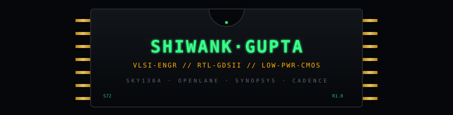

<!-- ══════════════════════════════════════════════════════════════════════ -->
<!--   SHIWANK GUPTA — VLSI / SEMICONDUCTOR ENGINEER — PROFILE DATASHEET   -->
<!--   Theme: Test-bench / oscilloscope lab — phosphor green + amber      -->
<!-- ══════════════════════════════════════════════════════════════════════ -->

<div align="center">



<br/><br/>

<a href="https://git.io/typing-svg">

</a>

<br/><br/>


&ensp;

&ensp;

&ensp;


</div>

<br/>

<div align="center">

</div>

<div align="center">

</div>

<!-- ══════════════════════════════════════════════════════════════════════ -->
<!--                  §00 — DEVICE SUMMARY                                -->
<!-- ══════════════════════════════════════════════════════════════════════ -->

<div align="center">

</div>

<br/>

<table width="100%">
<tr><td>

```
  PART NO.        SHIWANK-GUPTA-VLSI-01
  FUNCTION        VLSI Design Engineer · Design Verification · Low-Power CMOS
  PACKAGE         RTL Engineer  →  Digital ASIC Flow  →  Physical Design
  PROCESS ORIGIN  B.Tech ECE — UIET, Kurukshetra University
  QUAL. HISTORY   Diploma EE — Gold Medalist

  ────────────────────────────────────────────────────────────────────────
  OPERATING MODE (PRESENT)    NIK-CORE RTL→GDSII · 7-Day AMBA Sprint
  OPERATING MODE (VECTOR)     DV · STA · Timing Closure · Physical Design
  OPERATING MODE (FRONTIER)   UVM · ASIC Tapeout · Global Semiconductor R&D
```

</td></tr>
</table>

<div align="center">

</div>

<!-- ══════════════════════════════════════════════════════════════════════ -->
<!--                  §01 — ENGINEERING DOMAINS                           -->
<!-- ══════════════════════════════════════════════════════════════════════ -->

<div align="center">

</div>

<br/>

<table width="100%">
<tr>
<td width="25%" valign="top">

**`VLSI / ASIC DESIGN`**
```yaml
RTL:
  - Verilog / SystemVerilog
  - Digital ASIC Flow
  - Logic Synthesis
  - Clock Tree Synthesis
Analysis:
  - STA / Timing Closure
  - Power Analysis (PX)
  - DRC / LVS
  - Parasitic Extraction
Memory:
  - 6T SRAM (Full-Custom)
  - SNM Characterization
  - Multi-Corner SPICE
  - BSIM4 Modeling
```

</td>
<td width="25%" valign="top">

**`DESIGN VERIFICATION`**
```yaml
Functional Sim:
  - Testbench Development
  - Self-Checking TB
  - Directed Stress Testing
  - Multi-Corner Sim
Protocols:
  - AMBA AXI4-Lite
  - AHB / APB
  - UART / SPI / I2C
  - CAN Bus
Frontier:
  - SystemVerilog DV
  - UVM Methodology
  - Functional Coverage
  - Assertion-Based DV
```

</td>
<td width="25%" valign="top">

**`LOW-POWER CMOS`**
```yaml
Clock Mgmt:
  - Static ICG Gating
  - Dynamic Gating
  - Hybrid ICG Schemes
  - CTS Power Opt.
Power Techniques:
  - Power Gating
  - Multi-VTH Design
  - Dynamic Power Opt.
  - Static Power Opt.
NTV Research:
  - Near-Threshold Voltage
  - 28nm HKMG Analysis
  - 65nm Bulk CMOS
  - PDP Benchmarking
```

</td>
<td width="25%" valign="top">

**`PHYSICAL DESIGN`**
```yaml
PnR Flow:
  - Floorplanning
  - Placement & Routing
  - Clock Tree Synthesis
  - Power Grid (PDN)
Open-Source EDA:
  - OpenLane RTL→GDSII
  - Sky130 PDK
  - Magic VLSI · KLayout
  - OpenROAD
Signoff:
  - DRC-Clean Routing
  - GDSII Streamout
  - LVS (In Progress)
  - Antenna Check
```

</td>
</tr>
</table>

<div align="center">

</div>

<!-- ══════════════════════════════════════════════════════════════════════ -->
<!--                  §02 — TECHNICAL STACK                               -->
<!-- ══════════════════════════════════════════════════════════════════════ -->

<div align="center">

</div>

<br/>

<div align="center">

<sub>EDA · SIMULATION</sub><br/>


<br/><br/>

<sub>PHYSICAL DESIGN · OPEN-SOURCE RTL→GDSII</sub><br/>


<br/><br/>

<sub>HDL · PROGRAMMING</sub><br/>


<br/><br/>

<sub>FPGA · HARDWARE PLATFORMS</sub><br/>


<br/><br/>

<sub>PROTOCOLS · INTERFACES</sub><br/>


<br/><br/>

<sub>FRONTIER · ACTIVE STUDY</sub><br/>


</div>

<div align="center">

</div>

<!-- ══════════════════════════════════════════════════════════════════════ -->
<!--                  §03 — QUANTIFIED RESEARCH RESULTS                   -->
<!-- ══════════════════════════════════════════════════════════════════════ -->

<div align="center">

</div>

<br/>

<table width="100%">
<tr><td>

```
  ┌─ CLOCK GATING RESEARCH ── 45nm CMOS @ 200 MHz ─────────────────────────┐
  │  Baseline Dynamic Power   :  48.9 mW                                   │
  │  Post-ICG Dynamic Power   :  18.7 mW                                   │
  │  Reduction Achieved       :  61.7 %   ◀ PUBLISHED RESULT               │
  └─────────────────────────────────────────────────────────────────────────┘

  ┌─ FLIP-FLOP ARCHITECTURE STUDY ── 28nm HKMG + 65nm Bulk CMOS (NTV) ─────┐
  │  Architectures Benchmarked :  4  (Standard · TGFF · MHLAFF · ATC-SCDFF)│
  │  Best Power-Delay Product  :  0.32 fJ  (ATC-SCDFF)                     │
  │  PDP Improvement           :  69 %   ◀ PUBLISHED RESULT                │
  └─────────────────────────────────────────────────────────────────────────┘

  ┌─ 6T SRAM CELL ── Full-Custom SPICE Characterization (BSIM4) ──────────┐
  │  Static Noise Margin (SNM) :  92–108 mV                                │
  │  Corners Tested            :  TT / SS / FF / SNFP / FNSP              │
  │  Method                    :  Butterfly Curve + Transistor Sizing     │
  └─────────────────────────────────────────────────────────────────────────┘

  ┌─ NIK-CORE ── RTL-to-GDSII ASIC FLOW (Sky130A · OpenLane) ─────────────┐
  │  Flow Coverage    :  Synth → Floorplan → Place → CTS → Route → GDSII  │
  │  Routing Signoff  :  DRC-Clean (0 violations post detailed route)     │
  │  Std Cells Placed :  362  (8 DFFs · combinational logic)              │
  │  Core Utilization :  54.87 %                                          │
  │  Max Freq. (STA)  :  ~90.9 MHz   ◀ HANDS-ON PHYSICAL DESIGN           │
  └─────────────────────────────────────────────────────────────────────────┘
```

</td></tr>
</table>

<div align="center">

</div>

<!-- ══════════════════════════════════════════════════════════════════════ -->
<!--                  §04 — ENGINEERING COMPETENCIES                      -->
<!-- ══════════════════════════════════════════════════════════════════════ -->

<div align="center">

</div>

<br/>

<table width="100%">
<tr>
<td width="33%" valign="top">

**VLSI / ASIC Design**

RTL Design (Verilog)


Clock Gating (ICG)


Low-Power CMOS Analysis


SPICE / Circuit Sim


FPGA Implementation


Cadence Virtuoso


</td>
<td width="33%" valign="top">

**Design Verification**

Functional Testbench


Multi-Corner Simulation


STA / Timing Closure


DRC / LVS


SystemVerilog DV


UVM Methodology


</td>
<td width="33%" valign="top">

**Physical Design — RTL to GDSII**

Floorplanning / P&R


Clock Tree Synthesis


GDSII Streamout (Magic)


Routing DRC Signoff


LVS Signoff (netgen)


Full Custom Layout


</td>
</tr>
</table>

<div align="center">

</div>

<!-- ══════════════════════════════════════════════════════════════════════ -->
<!--                  §05 — FLAGSHIP ENGINEERING PROJECTS                 -->
<!-- ══════════════════════════════════════════════════════════════════════ -->

<div align="center">

</div>

<br/>

<details open>
<summary><b>&nbsp;01 · NIK-CORE — 8-bit RISC Processor — RTL to GDSII</b> &nbsp;—&nbsp; <i>Custom ISA · OpenLane · Sky130 PDK · Magic VLSI · KLayout</i></summary>

<br/>

```
  ARCHITECTURE     8-bit RISC — Custom Instruction Set Architecture
  PDK / NODE       Sky130A — SkyWater 130nm Open-Source PDK
  EDA FLOW         OpenLane (Yosys · OpenROAD · Magic · KLayout)
  FLOW COVERAGE    Synth → Floorplan → Place → CTS → Route → DRC-clean → GDSII
  STD LIBRARY      sky130_fd_sc_hd
  RESULT           DRC-Clean Routing · 362 Cells Placed · GDSII Generated
```

**Design Objective:** Take a custom 8-bit RISC processor from RTL through the complete open-source digital ASIC backend flow — synthesis, floorplanning, placement, clock tree synthesis, routing, and final GDSII layout generation — on the Sky130A process design kit.

**Flow Coverage:** RTL (ALU, control unit, register file, PC, instruction decoder) synthesized via Yosys → die/IO/PDN floorplanning → global + detailed placement → CTS via OpenROAD → fully DRC-clean detailed route across all metal layers → GDSII streamout verified in Magic, cross-checked in KLayout.

**Metrics (OpenLane `metrics.csv`):** Core Utilization 54.87% · Die Area 0.00435 mm² · 362 Placed Cells (8 DFFs + combinational logic) · Routed Wire Length 931,138 units · 822 Vias · STA Critical Path 11.0 ns → ~90.9 MHz max safe frequency.

**Status:** RTL-to-GDSII core flow complete and DRC-clean. LVS (netgen) and antenna signoff in progress toward Efabless OpenMPW shuttle readiness.

</details>

---

<details>
<summary><b>&nbsp;02 · High-Speed Digital I/O Pad Design</b> &nbsp;—&nbsp; <i>Cadence Virtuoso · LTSpice · ESD Protection · Signal Integrity</i></summary>

<br/>

```
  TOOLS         Cadence Virtuoso (full-custom layout) · LTSpice (simulation)
  PROTECTION    Integrated ESD clamp structures
  ANALYSIS      Post-layout parasitic extraction · SI characterization
```

**Objective:** Design and verify a high-speed CMOS digital I/O pad operating reliably at high switching frequency, while holding ESD protection and signal integrity together, built from scratch.

**Lessons Learned:** I/O pad parasitics are not secondary — ESD-structure capacitive loading directly caps max operating frequency. Latch-up risk in ESD cells demands careful well-tie / guard-ring placement, verified under high-current stimulus.

</details>

---

<details>
<summary><b>&nbsp;03 · 7-Day AMBA Protocol Series</b> &nbsp;—&nbsp; <i>AXI4-Lite · Active Sprint</i></summary>

<br/>

```
  PROTOCOL      AMBA AXI4-Lite — ARM AMBA 4 Specification
  FOCUS         Write / Read Channels · Handshaking · Response Logic
  HDL           Verilog / SystemVerilog · Xilinx Vivado
  STATUS        ACTIVE — day-by-day structured implementation
```

**Objective:** Implement a production-quality AXI4-Lite Master–Slave interface from scratch in a structured 7-day sprint, with waveform-validated VALID/READY handshaking across all channels and BRESP/RRESP decoding verified against spec.

</details>

---

<details>
<summary><b>&nbsp;04 · 14-Day RTL-to-DV Development Series</b> &nbsp;—&nbsp; <i>Verilog · Xilinx Vivado · FPGA Validated</i></summary>

<br/>

```
  Day 01-04   Gates → Mux/Demux → RCA → Decoder/Encoder      [DONE]
  Day 05-07   D-FF (sync/async) → Shift Reg → FSM            [DONE]
  Day 08-10   FIFO Buffer → SRAM Controller → UART Tx        [DONE]
  Day 11-14   ── in progress → target: full SV testbench ──  [ >> ]
```

**Approach:** Every module — RTL, synthesis, self-checking testbench, FPGA bitstream — built independently to production standard before moving on.

</details>

---

<details>
<summary><b>&nbsp;05 · Clock Gating Optimization — 61.7% Dynamic Power Reduction</b> &nbsp;—&nbsp; <i>45nm CMOS · Published Research</i></summary>

<br/>

```
  TARGET        32-bit RISC Processor Datapath
  NODE / CLK    45nm CMOS @ 200 MHz
  METHOD        Static ICG + Dynamic Gating + Hybrid ICG Scheme
  TOOL          Verilog RTL · Synopsys PrimeTime PX
  RESULT        48.9 mW → 18.7 mW  (61.7% reduction)
```

**Key Result:** Hybrid ICG scheme cut dynamic power 61.7% while holding full timing closure at 200 MHz across TT/SS/FF corners. Hybrid schemes consistently beat static- or dynamic-only gating on wide datapaths.

</details>

---

<details>
<summary><b>&nbsp;06 · Low-Power Flip-Flop Architecture Study — 69% PDP Improvement</b> &nbsp;—&nbsp; <i>28nm HKMG + 65nm Bulk CMOS · NTV · Published Research</i></summary>

<br/>

```
  NODES         28nm HKMG + 65nm Bulk CMOS
  REGIME        Near-Threshold Voltage (NTV)
  ARCHS TESTED  4 — Standard · TGFF · MHLAFF · ATC-SCDFF
  BEST RESULT   ATC-SCDFF — PDP 0.32 fJ — 69% improvement
```

**Key Result:** ATC-SCDFF's single-cycle discharge topology delivers a 69% PDP improvement over the transmission-gate baseline, holding timing compliance at NTV supply across both nodes.

</details>

---

<details>
<summary><b>&nbsp;07 · 6T SRAM Cell Design & SPICE Characterization</b> &nbsp;—&nbsp; <i>Full-Custom · BSIM4 · SNM 92–108 mV</i></summary>

<br/>

```
  CELL          6T SRAM — full-custom transistor design
  MODEL         BSIM4
  SNM RESULT    92–108 mV (read + write stability)
  CORNERS       TT / SS / FF / SNFP / FNSP
```

**Lessons Learned:** Cell ratio and pull-up ratio are coupled — optimizing read stability degrades write-ability by design. SNFP is worst-case read failure, FNSP is worst-case write failure; both validated independently.

</details>

---

<details>
<summary><b>&nbsp;08 · Smart Coach — AI-Powered Web Application</b> &nbsp;—&nbsp; <i>React · Firebase · Gemini API · Android APK</i></summary>

<br/>

```
  FRONTEND      React + Vite SPA
  AUTH / DB     Firebase Authentication + Firestore
  AI ENGINE     Google Gemini API — serverless proxy for key security
  DEPLOYMENT    Vercel (web) + Android APK (Capacitor)
```

**Lessons Learned:** API-key security in client-side React needs a serverless proxy — there's no other reliable option without a backend.

</details>

<div align="center">

</div>

<!-- ══════════════════════════════════════════════════════════════════════ -->
<!--                  §06 — REPOSITORY INDEX                              -->
<!-- ══════════════════════════════════════════════════════════════════════ -->

<div align="center">

</div>

<br/>

| # | Repository | Stack | Status |
|:-:|-----------|-------|--------|
| 01 | [**NIK-CORE 8-bit RISC — RTL to GDSII**](https://github.com/SHIWANK72/Project-NIK-CORE) | Verilog/SV · OpenLane · Sky130 PDK | ⭐ RTL→GDSII · DRC-Clean |
| 02 | [**7-Day AMBA Protocol Series**](https://github.com/SHIWANK72/7-days--AMBA-Protocol-Series) | Verilog · AXI4-Lite | ✅ Sprint Complete |
| 03 | [**14-Day RTL-to-DV Series**](https://github.com/SHIWANK72/14-DAYS-DEVELOPMENT-SERIES--RTL-TO-DV-) | Verilog · Vivado | ✅ Complete |
| 04 | [**Clock Gating Optimization**](https://github.com/SHIWANK72/Thesis-VLSI-Clock-Gating-Techniques) | Verilog · 45nm · PrimeTime PX | ⭐ Published · 61.7% ΔP |
| 05 | [**Low-Power Flip-Flop Study**](https://github.com/SHIWANK72/Thesis-Low-Power-Flip-Flop-Architectures) | SPICE · 28nm · 65nm CMOS | ⭐ Published · 69% PDP |
| 06 | [**Verilog 8-bit RISC Processor**](https://github.com/SHIWANK72/Verilog-8-bit-RISC-Processor) | Verilog · Vivado | ✅ FPGA Deployed |
| 07 | [**6T SRAM Cell Analysis**](https://github.com/SHIWANK72/VLSI-6T-SRAM-Cell-Analysis) | SPICE · BSIM4 | ✅ SNM: 92–108 mV |
| 08 | [**High-Speed I/O Pad Design**](https://github.com/SHIWANK72/VLSI-High-Speed-IO-Pad-Design) | Cadence Virtuoso · LTSpice | ✅ Complete |
| 09 | [**Smart Coach AI App**](https://github.com/SHIWANK72/My-Super-Coach) | React · Firebase · Gemini API | ✅ Deployed + APK |
| 10 | [**EV Regenerative Braking**](https://github.com/SHIWANK72/Innovation-EV-Regenerative-Braking) | Embedded C · Hardware | ✅ Hardware Prototype |
| 11 | [**3D Portfolio Website**](https://github.com/SHIWANK72/3d-portfolio) | React · TypeScript · Three.js | ✅ Live |
| 12 | [**Dual-Mode Autonomous Robot**](https://github.com/SHIWANK72/Dual-Mode-Autonomous-Robot) | C++ · Arduino | ✅ Complete |
| 13 | [**Hand Gesture Robot**](https://github.com/SHIWANK72/Hand-Gesture-Controlled-ROBOT) | Arduino · MPU6050 | ✅ Complete |
| 14 | [**3-Phase Instrumentation Panel**](https://github.com/SHIWANK72/Hardware-3-Phase-Instrumentation-Panel) | Hardware | ✅ Built & Tested |
| 15 | [**AC-to-Variable DC Converter**](https://github.com/SHIWANK72/Hardware-AC-to-Variable-DC-Converter) | Hardware · LM317 | ✅ Complete |
| 16 | [**Portfolio Website**](https://github.com/SHIWANK72/SHIWANK72.github.io) | HTML · CSS | ✅ Live |
| 17 | [**Hybrid CNN-GNN ShiftLeft DTCO**](https://github.com/SHIWANK72/Hybrid-CNN-GNN-ShiftLeft-DTCO) | Python · Apache 2.0 | 🔄 Active Development |
| 18 | [**Adv. ATMP — RTL to Packaging with DFT**](https://github.com/SHIWANK72/Research-on-ADV.-ATMP---RTL-TO-PACKAGING---WITH-DFT) | Research · DFT | 🔄 In Progress |

<div align="center">

</div>

<!-- ══════════════════════════════════════════════════════════════════════ -->
<!--                  §07 — ENGINEERING TIMELINE                          -->
<!-- ══════════════════════════════════════════════════════════════════════ -->

<div align="center">

</div>

<br/>

<table width="100%">
<tr><td>

```
  2019─22           2022─25              2024─25              2025─now
  Foundation         Industry Exposure    Production Results    Physical Design
  ───────────        ─────────────────    ──────────────────    ───────────────
  Diploma EE          TeamLease            Samsung SDS           NIK-CORE
  Gold Medalist       3-yr ASIC training   Data pipelines        RTL→GDSII
  B.Tech ECE, UIET    60 hrs/mo · reviews  Python · semi         OpenLane+Sky130
     │───────────────────│───────────────────│───────────────────│──▶
```

</td></tr>
</table>

<div align="center">

</div>

<!-- ══════════════════════════════════════════════════════════════════════ -->
<!--                  §08 — CERTIFICATIONS & TRAINING                     -->
<!-- ══════════════════════════════════════════════════════════════════════ -->

<div align="center">

</div>

<br/>

<table width="100%">
<tr><td>

```
  ◈ LEAN SIX SIGMA AI YELLOW BELT                          Jun 2026
    Council for Six Sigma Certification (CSSC) · Sparen & Gewinn Consulting
    Credential ID: SG2760AI58515

  ◈ VLSI (LIMITED) ASSESSMENT — GRADUATION LEVEL           May 2026
    Silicon Interfaces — B2Cie™ Platform · Grade: Very Good

  ◈ DIGITAL ASIC DESIGN — 3-YEAR INDUSTRY TRAINING   Sep 2022–Sep 2025
    TeamLease Services Limited · 60 hrs/month · RTL/Synthesis/Timing

  ◈ VLSI DESIGN & CADENCE VIRTUOSO                    Jul–Aug 2024
    Kurukshetra University · Letter of Recommendation Awarded
```

</td></tr>
</table>

<div align="center">

</div>

<!-- ══════════════════════════════════════════════════════════════════════ -->
<!--                  §09 — LANGUAGES                                     -->
<!-- ══════════════════════════════════════════════════════════════════════ -->

<div align="center">


<br/><br/>


</div>

<div align="center">

</div>

<!-- ══════════════════════════════════════════════════════════════════════ -->
<!--                  §10 — ASIC DESIGN FLOW                              -->
<!-- ══════════════════════════════════════════════════════════════════════ -->

<div align="center">

</div>

<br/>

<table width="100%">
<tr><td>

```
  RTL DESIGN              VERIFICATION             SYNTHESIS
  ──────────               ────────────             ─────────
  Verilog/SystemVerilog    Functional TB (VCS)      Yosys / Synopsys DC
  Clock Gating (ICG)       Self-Checking TB          Constraints / SDC
  Power Intent             Multi-Corner Sim          Area / Timing / GL-NL

  STA / TIMING             LOW-POWER                 PHYSICAL DESIGN
  ──────────                ─────────                 ───────────────
  PrimeTime PX              Clock Gating — 61.7% ΔP   OpenLane · Sky130A
  Setup/Hold Margins        Multi-VTH Optimization    Floorplan·Place·CTS·Route
  Clock Tree Analysis       NTV Design (28/65nm)      DRC-Clean · GDSII · LVS(WIP)
```

</td></tr>
</table>

<div align="center">

</div>

<!-- ══════════════════════════════════════════════════════════════════════ -->
<!--                  §11 — ENGINEERING PHILOSOPHY                        -->
<!-- ══════════════════════════════════════════════════════════════════════ -->

<div align="center">

</div>

<br/>

<table width="100%">
<tr><td align="center">

```
  "Logic does not forgive ambiguity.
   Every unverified state is a bug already in silicon."

  Every uninitialized flip-flop is metastability waiting for a clock edge.
  Every missing testbench is a corner case shipped to production.
  Every ignored timing violation is a field failure at worst temperature.

  Know the state machine. Verify every transition. Control every path.
```

</td></tr>
</table>

<div align="center">

</div>

<!-- ══════════════════════════════════════════════════════════════════════ -->
<!--                  §12 — GITHUB STATISTICS                             -->
<!-- ══════════════════════════════════════════════════════════════════════ -->

<div align="center">

</div>

<br/>

<div align="center">

<!-- Generated via a jstrieb/github-stats Action fork — see setup notes below.
     Until the Action has been run once, these two lines will 404; that's expected. -->

&nbsp;


</div>

<br/>

<div align="center">
<a href="https://github.com/SHIWANK72">
  
</a>
</div>

<br/>

<div align="center">
<a href="https://github.com/SHIWANK72">
  
</a>
</div>

<br/>

<!-- Static badges instead of a live trophy render — zero external API calls, never breaks.
     Edit this row any time you earn a new one. -->
<div align="center">


</div>

<div align="center">

</div>

<!-- ══════════════════════════════════════════════════════════════════════ -->
<!--                  §13 — CONTRIBUTION MAP                              -->
<!-- ══════════════════════════════════════════════════════════════════════ -->

<div align="center">

</div>

<br/>

<div align="center">
<!-- Snake still needs the Platane/snk GitHub Action set up in your repo (.github/workflows/snake.yml) -->

</div>

<div align="center">

</div>

<!-- ══════════════════════════════════════════════════════════════════════ -->
<!--                  §14 — CONNECT                                       -->
<!-- ══════════════════════════════════════════════════════════════════════ -->

<div align="center">

</div>

<br/>

<div align="center">

<table>
<tr>
<td align="center" width="25%">

**`EMAIL`**<br/>
[gupta.shiwank09@gmail.com](mailto:gupta.shiwank09@gmail.com)

</td>
<td align="center" width="25%">

**`LINKEDIN`**<br/>
[linkedin.com/in/guptashiwank](https://linkedin.com/in/guptashiwank)

</td>
<td align="center" width="25%">

**`GITHUB`**<br/>
[github.com/SHIWANK72](https://github.com/SHIWANK72)

</td>
<td align="center" width="25%">

**`LOCATION`**<br/>
Panchkula, Haryana, India

</td>
</tr>
</table>

<br/>

```
  OPEN TO OPPORTUNITIES IN:
  VLSI Design · Physical Design (RTL to GDSII) · Design Verification
  RTL Engineering · FPGA Development · Semiconductor R&D · STA/Timing Analysis
  Hardware Testing · ASIC Verification · Global Relocation Ready ✓
```

<br/>


</div>

<br/>


